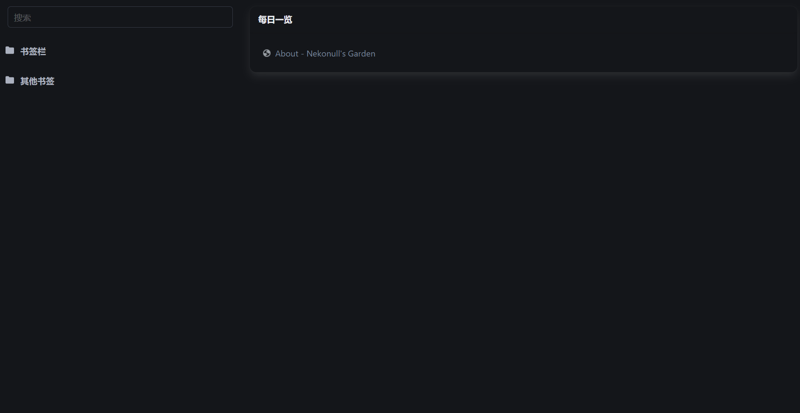
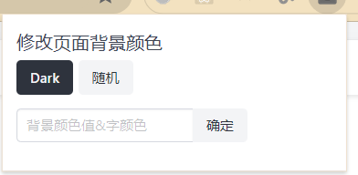
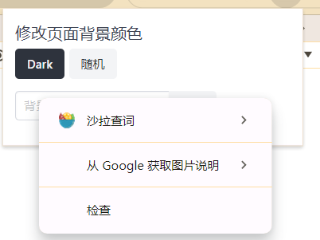
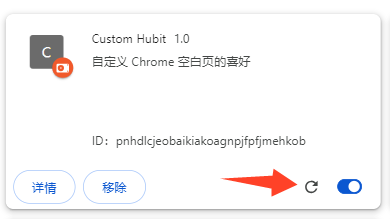

# Bookmark

> Chrome 打开一个空页面时，展示书签

## 功能
- 展示所有书签，默认折叠，并带搜索功能

- 随机展示一条书签

- 点击扩展，可更改当前浏览页面的背景颜色和字体

## 开发

### 加载本地的 Chrome Extension

浏览器中输入 `chrome://extensions/`，选择 `Load uppacked`

### 调试 Popup.html

- 打开 popup
- 在 popup 上鼠标右击
- 选择检查（inspect）

### 更新
当需要重新加载插件时，可以进入 `chrome://extensions/` ，找到插件，并点击更新按钮。

